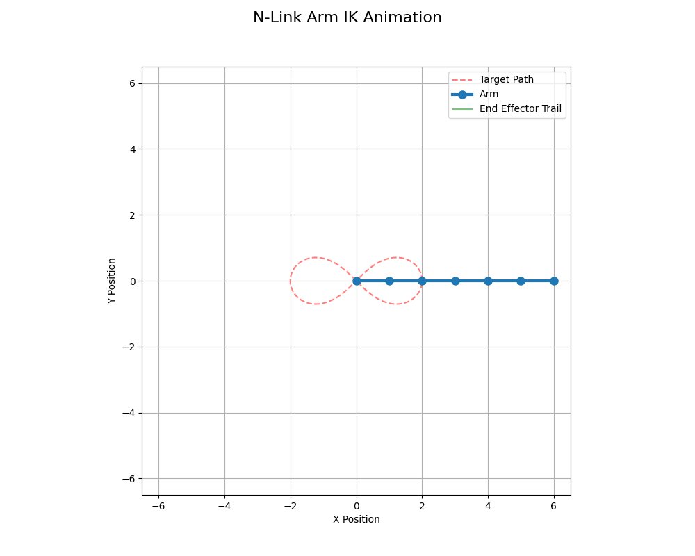

a scrappily, curiosity based inverse kinematics solver using optimization.

throwing this up on github as it currently sits on my laptop - leaving my comments and intuition in the notebooks as-is.

inspired by my friend Sajiv Shah to build this out on my own based on intuition.

cool animation it made:
